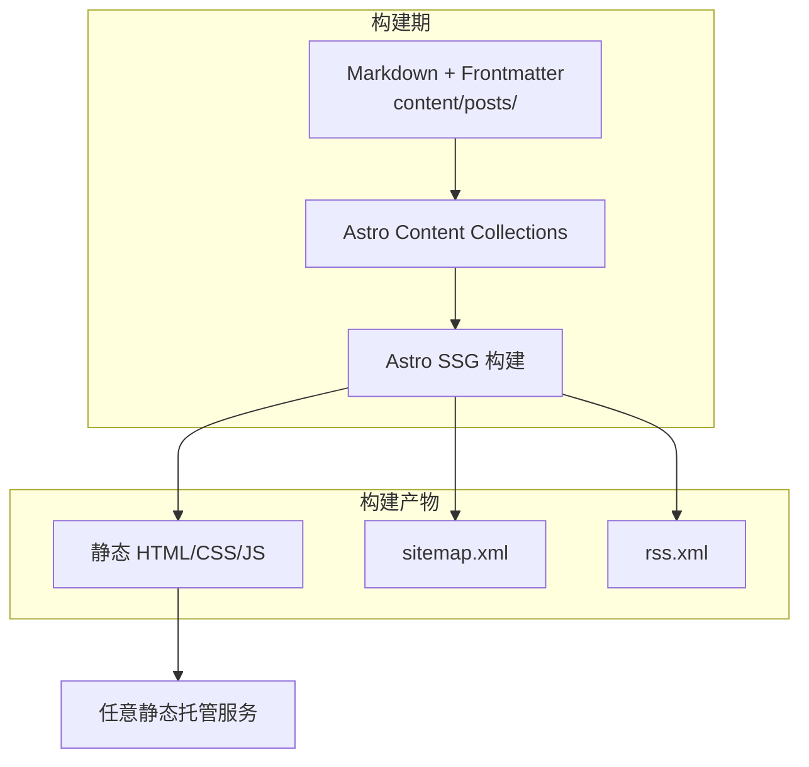
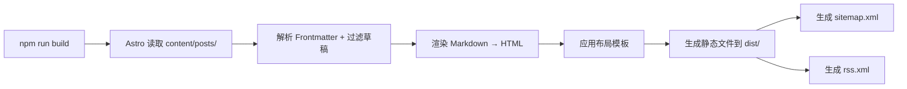
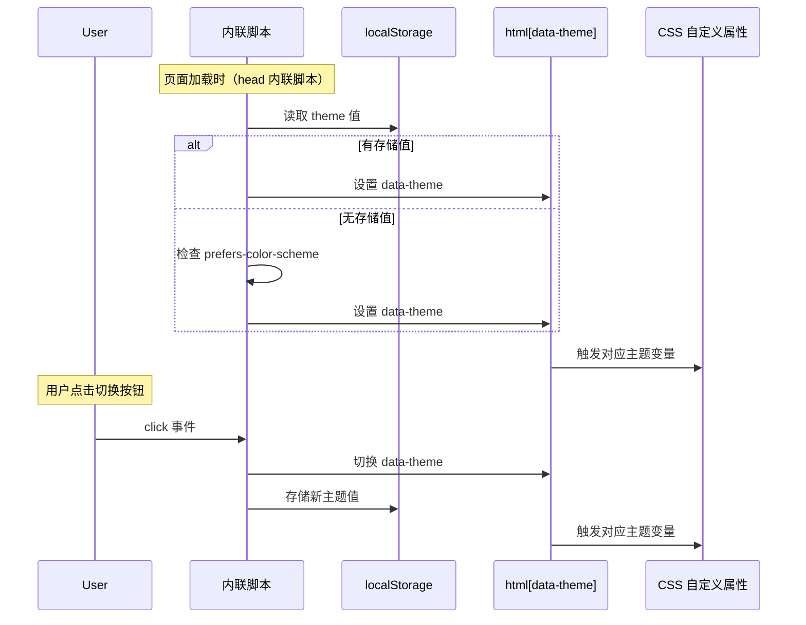

# 技术设计文档：Astro 静态博客（阶段 1）

## 概述

本设计文档描述个人内容系统阶段 1（内容最小闭环）的技术实现方案。系统使用 Astro SSG 将 Markdown 文件构建为静态博客站点，设计风格参考 joshwcomeau.com，强调温暖色调、圆角设计和舒适的阅读体验。

核心设计决策：
- **纯静态输出**：无后端、无数据库，构建产物为纯 HTML/CSS/JS
- **Astro Content Collections**：利用 Astro 内置的内容集合 API 管理 Markdown 文章
- **原生 JS 交互**：暗色模式切换等客户端交互使用原生 JavaScript，不引入框架
- **CSS 自定义属性驱动主题**：通过 CSS Custom Properties 实现亮色/暗色模式切换
- **渐进增强**：页面在无 JS 环境下仍可完整阅读

## 架构

### 整体架构



### 页面路由结构

| 路由 | 页面 | 数据来源 |
|------|------|----------|
| `/` | 文章列表页（首页） | 所有非草稿文章，按日期降序 |
| `/posts/{slug}` | 文章详情页 | 单篇文章 Markdown 内容 |
| `/rss.xml` | RSS 订阅源 | 所有非草稿文章 |
| `/sitemap.xml` | 站点地图 | 所有已发布页面 URL |

### 构建流程



## 组件与接口

### 项目目录结构

```
astro-blog/
├── astro.config.mjs          # Astro 配置（集成 sitemap、rss）
├── package.json
├── tsconfig.json
├── public/
│   └── favicon.svg
├── src/
│   ├── content/
│   │   ├── config.ts          # Content Collections schema 定义
│   │   └── posts/             # Markdown 文章目录
│   │       └── hello-world.md
│   ├── layouts/
│   │   └── BaseLayout.astro   # 基础布局（含 head、nav、footer）
│   ├── pages/
│   │   ├── index.astro        # 首页（文章列表）
│   │   ├── posts/
│   │   │   └── [slug].astro   # 文章详情页（动态路由）
│   │   └── rss.xml.ts         # RSS 生成端点
│   ├── components/
│   │   ├── Navbar.astro       # 导航栏组件
│   │   ├── Footer.astro       # 页脚组件
│   │   ├── ArticleCard.astro  # 文章卡片组件
│   │   └── ThemeToggle.astro  # 主题切换按钮组件
│   └── styles/
│       └── global.css         # 全局样式（CSS 自定义属性、主题变量）
└── dist/                      # 构建输出目录
```

### 核心组件

#### BaseLayout.astro

基础页面布局，所有页面共享。

```
Props:
  - title: string        // 页面标题，用于 <title> 和 OG 标签
  - description?: string // 页面描述，用于 meta description 和 OG 标签

职责:
  - 渲染 <html>、<head>、<body> 结构
  - 注入 SEO 元标签（title、description、Open Graph）
  - 注入 RSS 自动发现标签
  - 包含 Navbar 和 Footer
  - 加载全局样式
  - 注入主题初始化脚本（防止闪烁）
```

#### Navbar.astro

```
Props: 无

职责:
  - 渲染站名（链接到首页）
  - 渲染 ThemeToggle 组件
  - 渲染 RSS 图标链接
  - 固定在页面顶部
```

#### ThemeToggle.astro

```
Props: 无

职责:
  - 渲染切换按钮（太阳/月亮图标）
  - 内联 <script> 处理点击事件
  - 读写 localStorage 存储主题偏好
  - 切换 <html> 元素的 data-theme 属性
```

#### ArticleCard.astro

```
Props:
  - title: string    // 文章标题
  - date: Date       // 发布日期
  - slug: string     // URL slug
  - excerpt: string  // 文章摘要

职责:
  - 渲染卡片容器（圆角、阴影）
  - 展示标题、日期、摘要
  - 渲染"阅读更多"链接，指向 /posts/{slug}
```

#### Footer.astro

```
Props: 无

职责:
  - 渲染版权信息（含当前年份）
  - 渲染社交媒体图标链接（GitHub 等）
```

### 页面组件

#### index.astro（首页）

```
数据获取:
  - 使用 getCollection('posts') 获取所有文章
  - 过滤 draft !== true 的文章
  - 按 date 降序排序

渲染:
  - 使用 BaseLayout 包裹
  - 遍历文章列表，渲染 ArticleCard 组件
```

#### [slug].astro（文章详情页）

```
数据获取:
  - getStaticPaths() 返回所有非草稿文章的 slug
  - 通过 slug 获取对应文章的 Content 组件

渲染:
  - 使用 BaseLayout 包裹（传入文章标题和描述）
  - 渲染文章标题和格式化日期
  - 渲染 <Content /> 组件（Markdown → HTML）
  - 文章内容区域应用 prose 排版样式
```

#### rss.xml.ts

```
职责:
  - 使用 @astrojs/rss 包生成 RSS feed
  - 包含所有非草稿文章的标题、链接、日期、摘要
```

### 主题切换机制



关键设计决策：主题初始化脚本必须放在 `<head>` 中以内联方式执行，避免页面加载时的主题闪烁（FOUC）。

## 数据模型

### Frontmatter Schema

使用 Astro Content Collections 的 Zod schema 定义：

```typescript
// src/content/config.ts
import { defineCollection, z } from 'astro:content';

const posts = defineCollection({
  type: 'content',
  schema: z.object({
    title: z.string(),
    slug: z.string(),
    date: z.coerce.date(),
    draft: z.boolean().default(false),
  }),
});

export const collections = { posts };
```

| 字段 | 类型 | 必填 | 默认值 | 说明 |
|------|------|------|--------|------|
| `title` | string | 是 | - | 文章标题 |
| `slug` | string | 是 | - | URL 路径标识符 |
| `date` | Date | 是 | - | 发布日期 |
| `draft` | boolean | 否 | `false` | 是否为草稿 |

### 示例 Markdown 文件

```markdown
---
title: "Hello World"
slug: "hello-world"
date: 2025-01-15
draft: false
---

这是我的第一篇博客文章。

## 二级标题

正文内容...

```javascript
console.log('代码高亮示例');
```　
```

### CSS 主题变量模型

```css
/* 亮色模式（默认） */
:root,
html[data-theme="light"] {
  --color-bg: #faf8f5;
  --color-bg-card: #ffffff;
  --color-text: #2d2d2d;
  --color-text-secondary: #6b6b6b;
  --color-accent: #e07a5f;
  --color-border: #e8e4df;
  --color-shadow: rgba(0, 0, 0, 0.06);
  --color-code-bg: #f5f2ef;
  --radius: 12px;
  --shadow-card: 0 2px 8px var(--color-shadow);
}

/* 暗色模式 */
html[data-theme="dark"] {
  --color-bg: #1a1a2e;
  --color-bg-card: #25253e;
  --color-text: #e0e0e0;
  --color-text-secondary: #a0a0b0;
  --color-accent: #f4845f;
  --color-border: #3a3a5c;
  --color-shadow: rgba(0, 0, 0, 0.3);
  --color-code-bg: #2a2a45;
}
```

### 摘要生成策略

文章摘要从 Markdown 正文中自动提取，取前 120 个字符（去除 Markdown 标记后的纯文本）。不在 Frontmatter 中额外声明摘要字段，保持 Frontmatter 的简洁性。

实现方式：在构建期通过 Astro 的 `body` 属性获取原始 Markdown 文本，使用正则去除标记后截取。


## 正确性属性

*正确性属性是在系统所有有效执行中都应成立的特征或行为——本质上是对系统应做什么的形式化陈述。属性是人类可读规格说明与机器可验证正确性保证之间的桥梁。*

### Property 1: Frontmatter 解析往返

*对于任意*有效的 Frontmatter 对象（包含 title、slug、date、draft 字段），将其序列化为 YAML 格式后再解析回来，应产生与原始对象等价的值。

**Validates: Requirements 1.2**

### Property 2: 草稿文章过滤

*对于任意*文章集合（包含不同 draft 状态的文章），经过过滤后的输出列表应仅包含 `draft !== true` 的文章，且所有非草稿文章都应出现在输出中。

**Validates: Requirements 1.3, 2.1**

### Property 3: 文章卡片包含必要信息

*对于任意*文章（具有随机生成的 title、date、slug、excerpt），渲染后的文章卡片 HTML 应包含该文章的标题文本、格式化的日期、摘要文本和指向 `/posts/{slug}` 的链接。

**Validates: Requirements 2.2, 2.4**

### Property 4: 文章按日期降序排列

*对于任意*文章列表（包含随机日期的文章），排序后的输出列表中每篇文章的日期应大于或等于其后一篇文章的日期。

**Validates: Requirements 2.3**

### Property 5: Slug 决定 URL 路径

*对于任意*文章及其 slug 值 S，系统生成的页面 URL 路径应为 `/posts/S`，且文章详情页应在该路径下可访问。

**Validates: Requirements 3.3, 2.4**

### Property 6: 主题切换为对合操作

*对于任意*初始主题状态（light 或 dark），执行一次主题切换应将主题变为相反值，再执行一次切换应恢复为初始主题状态。

**Validates: Requirements 5.2**

### Property 7: 主题偏好持久化往返

*对于任意*主题值（light 或 dark），将其存储到 localStorage 后再读取，应得到与存储时相同的主题值，且页面加载时应应用该主题。

**Validates: Requirements 5.3, 5.4**

### Property 8: SEO 元标签完整性

*对于任意*文章详情页（具有随机 title 和 description），渲染后的 HTML `<head>` 应包含正确的 `<title>` 标签、`<meta name="description">` 标签，以及 `og:title`、`og:description`、`og:type` Open Graph 元标签。

**Validates: Requirements 8.2, 8.3**

### Property 9: Sitemap 包含所有已发布页面

*对于任意*已发布文章集合，生成的 `sitemap.xml` 应包含每篇文章对应的 URL（`/posts/{slug}`），且不包含草稿文章的 URL。

**Validates: Requirements 8.4**

### Property 10: RSS Feed 包含所有已发布文章

*对于任意*已发布文章集合，生成的 RSS Feed 中每篇文章的条目应包含标题、链接（`/posts/{slug}`）、发布日期和摘要，且条目数量应等于已发布文章数量。

**Validates: Requirements 9.2**

## 错误处理

### Frontmatter 校验错误

- 当 Markdown 文件的 Frontmatter 缺少必填字段（title、slug、date）时，Astro Content Collections 的 Zod schema 会在构建期抛出校验错误，构建失败并输出明确的错误信息
- 当 `date` 字段格式不合法时，`z.coerce.date()` 会抛出解析错误

### 构建期错误

- Markdown 语法错误：Astro 的 Markdown 渲染器会尽量容错处理，不会导致构建失败
- 文件编码错误：确保所有 Markdown 文件使用 UTF-8 编码
- slug 冲突：如果两篇文章使用相同的 slug，Astro 会在构建期报告路由冲突错误

### 客户端错误

- localStorage 不可用（隐私模式等）：主题切换脚本应使用 try-catch 包裹 localStorage 操作，降级为仅在当前会话中生效
- JavaScript 禁用：页面内容仍可完整阅读，主题切换功能不可用但不影响默认主题显示

## 测试策略

### 双重测试方法

本项目采用单元测试与属性测试相结合的方式确保正确性：

- **单元测试**：验证具体示例、边界情况和错误条件
- **属性测试**：验证跨所有输入的通用属性

两者互补，缺一不可。

### 属性测试配置

- **测试库**：使用 [fast-check](https://github.com/dubzzz/fast-check) 作为属性测试库（JavaScript/TypeScript 生态中最成熟的 PBT 库）
- **测试框架**：Vitest（与 Astro 生态兼容）
- **每个属性测试最少运行 100 次迭代**
- **每个属性测试必须通过注释引用设计文档中的属性编号**
- **标签格式**：`Feature: astro-static-blog, Property {number}: {property_text}`
- **每个正确性属性由一个属性测试实现**

### 单元测试范围

单元测试聚焦于：
- 具体示例：验证特定输入产生预期输出（如特定 Frontmatter 的解析结果）
- 边界情况：空文章列表、极长标题、特殊字符 slug
- 错误条件：缺失 Frontmatter 字段、无效日期格式
- 集成验证：导航栏包含站名/RSS 链接/主题切换按钮、页脚包含版权信息和社交链接
- 构建验证：构建命令成功执行、dist 目录包含预期文件

### 属性测试范围

每个正确性属性对应一个属性测试：

| 属性 | 测试描述 | 生成器 |
|------|----------|--------|
| Property 1 | Frontmatter 序列化/反序列化往返 | 随机 title、slug、date、draft 值 |
| Property 2 | 草稿过滤只保留非草稿文章 | 随机文章集合（混合 draft 状态） |
| Property 3 | 文章卡片包含所有必要字段 | 随机文章元数据 |
| Property 4 | 排序后日期严格降序 | 随机日期列表 |
| Property 5 | slug 映射到正确 URL | 随机合法 slug 字符串 |
| Property 6 | 主题双次切换恢复原状 | 随机初始主题（light/dark） |
| Property 7 | 主题存储后读取一致 | 随机主题值 |
| Property 8 | HTML head 包含所有 SEO 标签 | 随机 title 和 description |
| Property 9 | sitemap 包含所有已发布文章 URL | 随机文章集合 |
| Property 10 | RSS 包含所有已发布文章条目 | 随机文章集合 |

### 测试文件组织

```
tests/
├── unit/
│   ├── frontmatter.test.ts      # Frontmatter 解析单元测试
│   ├── components.test.ts       # 组件渲染单元测试
│   └── build.test.ts            # 构建产物验证
└── properties/
    ├── frontmatter.prop.test.ts # Property 1
    ├── filtering.prop.test.ts   # Property 2
    ├── card.prop.test.ts        # Property 3
    ├── sorting.prop.test.ts     # Property 4
    ├── routing.prop.test.ts     # Property 5
    ├── theme.prop.test.ts       # Property 6, 7
    ├── seo.prop.test.ts         # Property 8
    ├── sitemap.prop.test.ts     # Property 9
    └── rss.prop.test.ts         # Property 10
```
